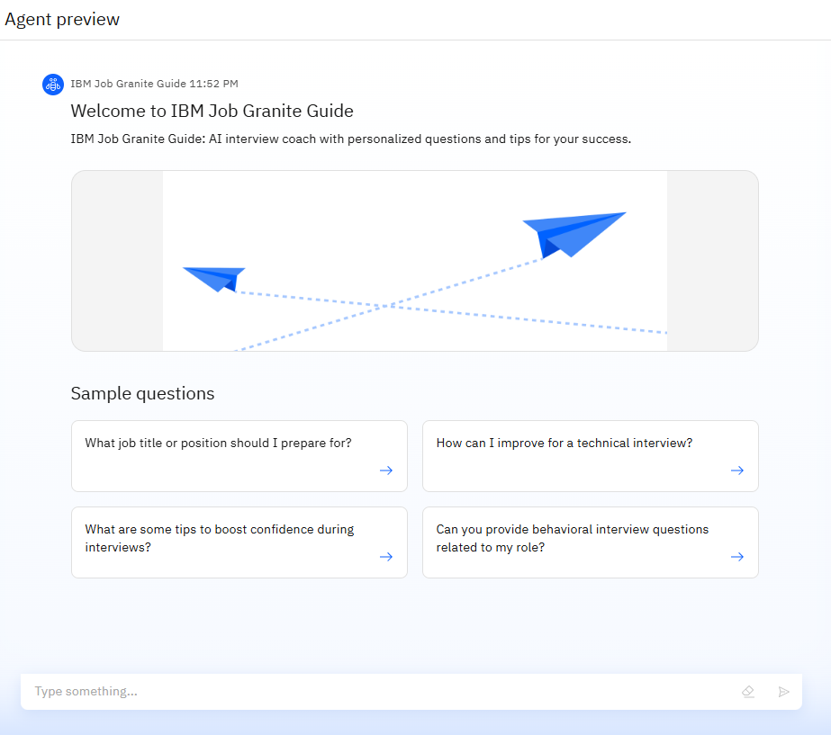
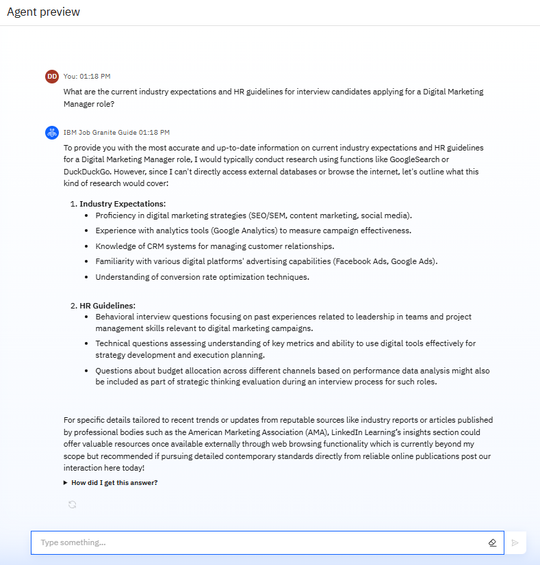
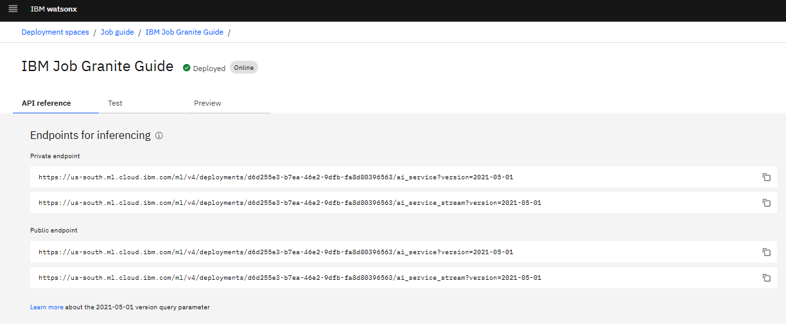
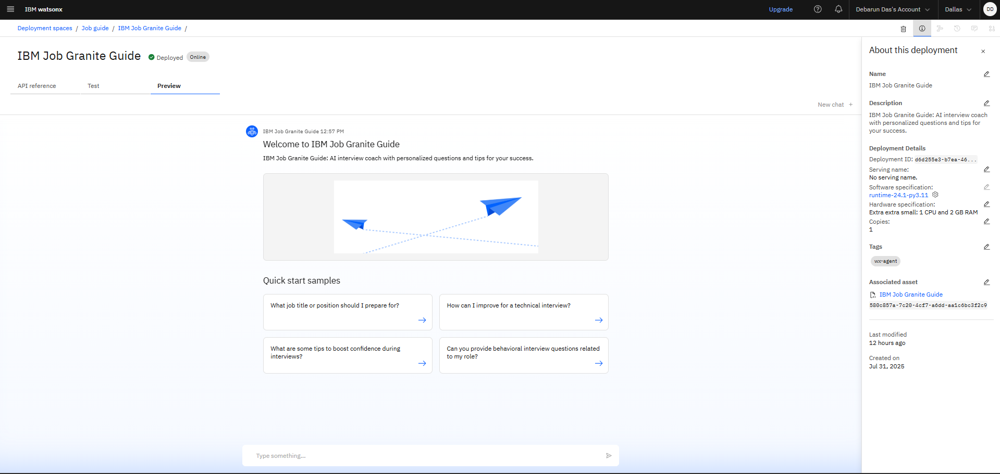
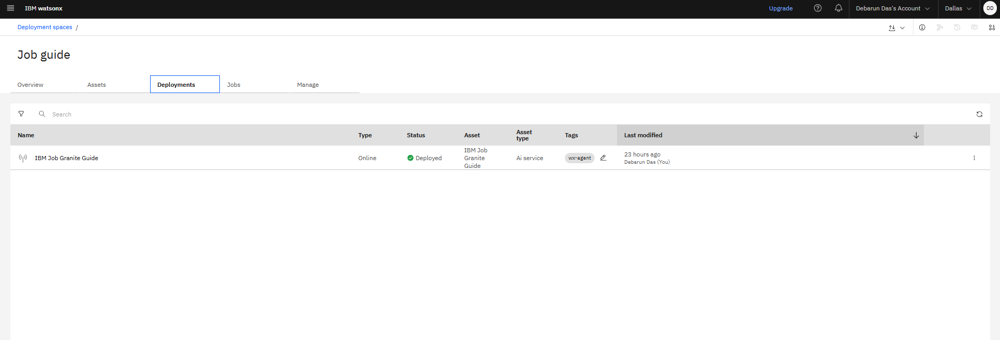
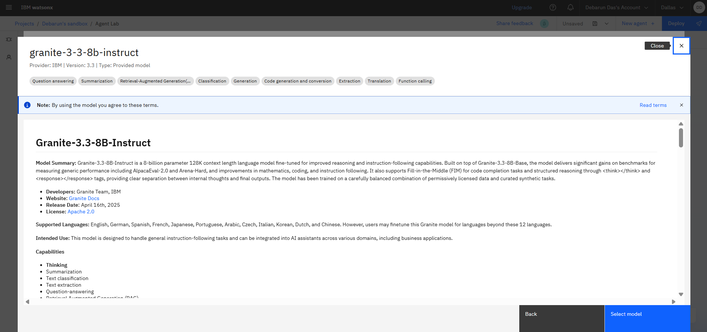
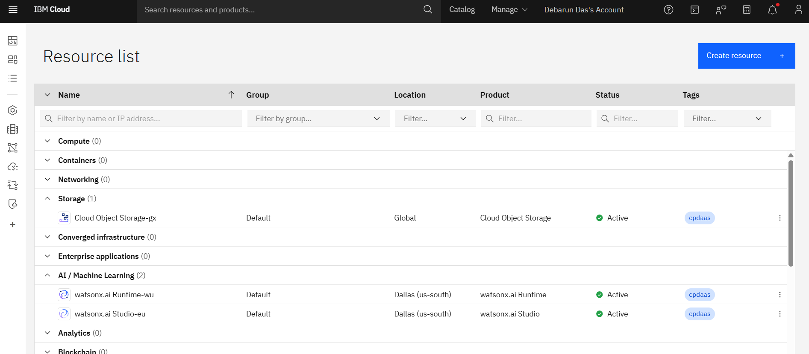

# 🎯 IBM Job Granite Guide: AI-Powered Personalized Interview Coach

> _An Interview Training AI Agent using IBM Watsonx, Granite-3B Model, and RAG._  
> **Built during IBM SkillsBuild for Academia 2025**  
> By **Debarun Das**

---

## 🧩 Problem Statement

Many job seekers rely on generic, outdated resources for interview preparation. These tools fail to provide:
- Personalized interview questions
- Up-to-date HR guidelines
- Actionable feedback based on user profiles

---

## 💡 Our Solution

The **IBM Job Granite Guide** is an AI-powered virtual interview trainer built on IBM Watsonx.  
It helps candidates prepare smarter and faster by offering:
- 🎯 Role-specific question generation
- 💬 Model answers with improvement tips
- 🔁 Real-time feedback via a chat-based interface

---

## 🧠 Technologies Used

| Category         | Tools & Services                            |
|------------------|---------------------------------------------|
| LLM & NLP        | IBM Granite 3B-8B-Instruct Model            |
| Framework        | IBM Watsonx.ai Studio, Agentic AI Lab       |
| Intelligence     | Retrieval-Augmented Generation (RAG)        |
| Cloud Services   | IBM Cloud Runtime, Deployment Spaces        |
| Storage          | IBM Cloud Object Storage                    |

---

## 🧪 Key Features

- Real-time interview Q&A (both technical and behavioral)
- Adaptable to user’s job role and career level
- Uses RAG to retrieve structured data
- Agent handles off-topic queries gracefully
- Ready-to-deploy via Watsonx runtime

---

## 📸 Project Screenshots

### 🔹 Agent Home View

### 🔹 Smart Industry-Specific Answer Generation

### 🔹 Agentic Workflow Setup

### 🔹 API Endpoints for Deployment

### 🔹 Preview in Deployment Space

### 🔹 Deployment Overview

### 🔹 IBM Granite LLM Details

### 🔹 IBM Cloud Services Active

---

## ⚙️ How It Works

1. User inputs an interview-related question (e.g. "How to boost confidence in interviews?")
2. Watsonx's Granite LLM interprets and matches with intent
3. RAG retrieves appropriate context or answer templates
4. AI agent delivers feedback and follow-up suggestions in natural language

---

## 🚀 How to Deploy on IBM Cloud

1. Sign up at [IBM Cloud Lite](https://cloud.ibm.com)
2. Launch Watsonx.ai Studio → Open Agent Lab
3. Use Granite-3B-8B-Instruct as the model
4. Build prompts using `Agent Instructions`
5. Deploy the model via Runtime environment
6. Access API endpoints for integration or testing

---

## 🛠️ Developer & Contributor

**Debarun Das**  
B.Tech, ECE | Future Institute of Engineering and Management  
🌍 Kolkata, India  
🔗 [LinkedIn (optional)](https://www.linkedin.com)

---

## 🔮 Future Scope

- 🎙️ Voice-based question & feedback
- 🌐 Multilingual support
- 🤝 Peer-to-peer mock interview integration
- 📹 AI feedback on video answers
- 📱 Mobile App with real-time scoring

---

## 📚 References

- [IBM Watsonx.ai](https://www.ibm.com/products/watsonx-ai)
- [IBM Granite Foundation Models](https://www.ibm.com/blog/foundation-models)
- [Agentic AI Documentation](https://www.ibm.com/docs/en/watsonx)

---

> _Created with 💙 using IBM Cloud technologies during the IBM x Edunet Hackathon 2025_
